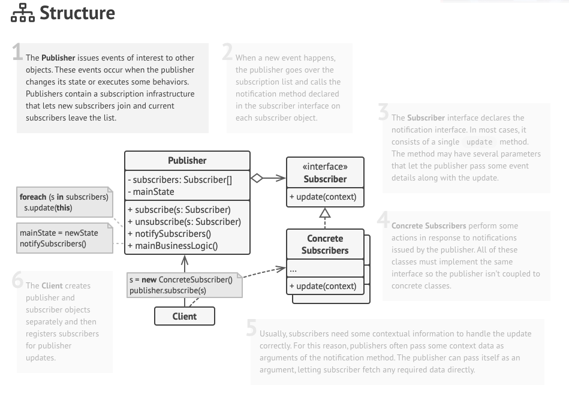

# Observer

객체의 상태 변화를 감지하고 이 변화에 따라 반응해야 할 때 사용하는 패턴이다.

Observer 패턴을 사용하지 않는다면 Polling 을 이용해서 구현을 해야겠지.

이를 통해 publish/subscribe 패턴을 구현할 수 있다.

- 다수의 객체가 특정 객체 상태 변화를 감지하고 알림을 받는 패턴



- Publisher 에 Subscriber 들을 등록해놓고 이벤트가 발생하면 이를 Subscriber 들에게 알려준다.
- Subscriber 는 이벤트가 왔을때 해야하는 로직을 정의해놓는다.

### 장점

- 상태를 변경하는 객체와 상태 변경을 감지하는 객체간의 느슨하게 결합할 수 있다.
- Polling 하는 방식 말고 상태 변경을 감지할 수 있다.
- 런타임에 옵저버를 추가하거나 제거하는게 가능하다.

### 단점

- 역시 코드의 복잡도가 좀 증가한다.
- Observer 해지에 대해서 신경쓰지 않는다면 많은 메모리 누수가 발생할 수 있다.
- Map 을 사용해서 객체를 등록할 땐 메모리 누수에 대해서 조심해야한다. WeakReference 를 사용한다던지.

### Applicability

- 객체의 상태 변화를 감지해야 하지만 이 타이밍을 미리 알 수 없는 경우에 이 패턴을 고려해봐라.

### 실제로 사용하는 예

- 자바 9 에서 리액티브 스트림을 구현할 수 있도록 도와주는 Flow API 가 있다.
    - Publisher, Subscriber, Subscription, Processor 가 있다.
        - Processor 는 Subscriber, Publisher 의 두 역할을 같이하는 것이다.
        - Publisher 가 메시지를 보내고 Subscriber 가 메시지를 받아서 처리하는 역할을 한다.
        - Subscription 을 통해서 저장된 메시지를 가지고 오도록 하는 비동기 처리를 도와준다.

```java
@FunctionalInterface
public static interface Publisher<T> {

    public void subscribe(Subscriber<? super T> subscriber);
}

    
public static interface Subscriber<T> {
  
	  public void onSubscribe(Subscription subscription);

	  public void onNext(T item);

	  public void onError(Throwable throwable);

	  public void onComplete();
}

public static interface Subscription {
    
	  public void request(long n);

    public void cancel();
}

    
public static interface Processor<T,R> extends Subscriber<T>, Publisher<R> {
}

    static final int DEFAULT_BUFFER_SIZE = 256;

    public static int defaultBufferSize() {
        return DEFAULT_BUFFER_SIZE;
    }
}
```