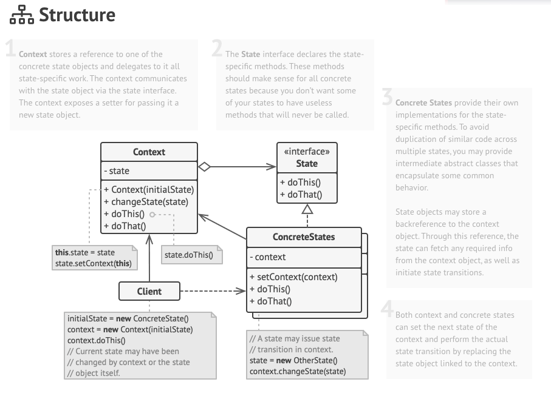

# State

특정한 상태에 따라 행동이 달라지는 객체를 위한 패턴이다.

- 똑같은 동작을 하게 하더라도 상태에 따라서 달라질 수 있다. 예로 TV 가 꺼져있으면 리모컨으로 어떠한 행동을 해도 반응하지 않는다. 반대로 TV 가 켜져있다면 리모컨의 행동에 따라 TV 가 반응한다.
- 상태에 특화된 행동을 분리해낼 수 있고, 상태 패턴을 이용하면 새로운 행동을 추가하더라도 다른 행동에 영향을 주지 않는다.

바로 예시로보자. State Pattern 을 사용하지 않는다면 다음과 같이 상태에 따라서 체크하는 로직이 필요로한다.

```java
public class OnlineCourse {
	private State state; 
	private Set<Student> students = new HashSet<>(); 

	public void addStudent(Student student) {
		if (state == Stage.DRAFT) {
			throw new UnsupportOperationException("학생을 해당 수업에 추가할 수 없습니다."); 
		}
		else if (state == State.PUBLISHED) {
			students.add(student); 
		}
		else if (state == State.PRIVATE && availableTo(student)) {
			students.add(student); 
		}
	}

	public boolean availableTo(Student studnet) {
			... 
	}
}
```

- OnlineCourse 는 State 를 가지므로 각 상태에 따라서 동작하는 행동이 다르다. 그러므로 Operation 안에는 상태를 검사하는 로직이 있어야한다.

상태 패턴의 구조는 다음과 같다.



- Context 와 State 는 서로 분리되고 Context 가 State 를 참조하는 구조를 가지며 State 도 Context 를 참조하며 조건에 따라 Context 의 상태를 변경시키도록 한다.
- 상태에 특화된 행동은 모두 State 안에 캡슐화 된다.

State 패턴을 적용하면 이렇게 변경될 것이다.

```java
public class OnlineCourse {
	private State state = new Draft(this); 
	private Set<Student> students = new HashSet<>(); 

	public void changeState(State state) {
		this.state = state; 
	}	

	public void addStudent(Student student) {
		state.addStudent(student); 
	}

	
	public boolean availableTo(Student studnet) {
			... 
	}

	public void published() {
		changeState(new Published(this)); 
	}

	public void publishedWithPrivate() {
		changeState(new Private(this)); 
	}
}
```

```java
public interface State {
	void addStudent(Student student); 
}
```

```java
public class Draft implements State {
	private OnlineCourse onlinecourse; 
	
	public Draft(OnlineCourse onlineCourse) {
		this.onlineCourse = onlineCourse; 
	}

	@Override
	public void addStudent(Student student) {
		throw new UnsupportOperationException("드래프트 상태에선 학생을 추가할 수 없습니다.");
	}
}
```

```java
public class Private implements State {
	private OnlineCourse onlinecourse; 
	
	public Private(OnlineCourse onlineCourse) {
		this.onlineCourse = onlineCourse; 
	}

	@Override
	public void addStudent(Student student) {
		if (onlineCourse.availableTo(student) {
			onlineCourse.getStudents().add(student); 
		}		
	}	
}
```

```java
public class Published implements State {
	private OnlineCourse onlinecourse; 
	
	public Published(OnlineCourse onlineCourse) {
		this.onlineCourse = onlineCourse; 
	}

	@Override
	public void addStudent(Student student) {
		onlineCourse.getStudents().add(student); 
	}	
}
```

- Context 인 OnlineCourse 가 있고 각 상태는 개별 클래스로 캡슐화했다.
- 이를 통해 상태에 기반한 행동은 모두 Context 와 분리되도록 했다.

### 장점과 단점

- 상태에 따른 동작을 개별 상태 클래스로 옮길 수 있다.
    - 이를 통해 SRP 를 지킬 수 있고, 확장에도 열려있고, 코드를 이해하기가 더 쉽다.

### Applicability

- 현재 객체가 상태에 따라 다르게 동작해야 하고 상태가 많고 상태가 자주 변경될 가능성이 있다면 상태 패턴을 고려해보자.
- 클래스가 필드 값 조건에 따라 다르게 행동하고 있도록 설계되었다면 상태 패턴을 통해서 개선할 수 있다.
- 상태를 기반으로 검사하는 조건문이 중복되는 경우가 많다면 상태 패턴을 고려해보자.