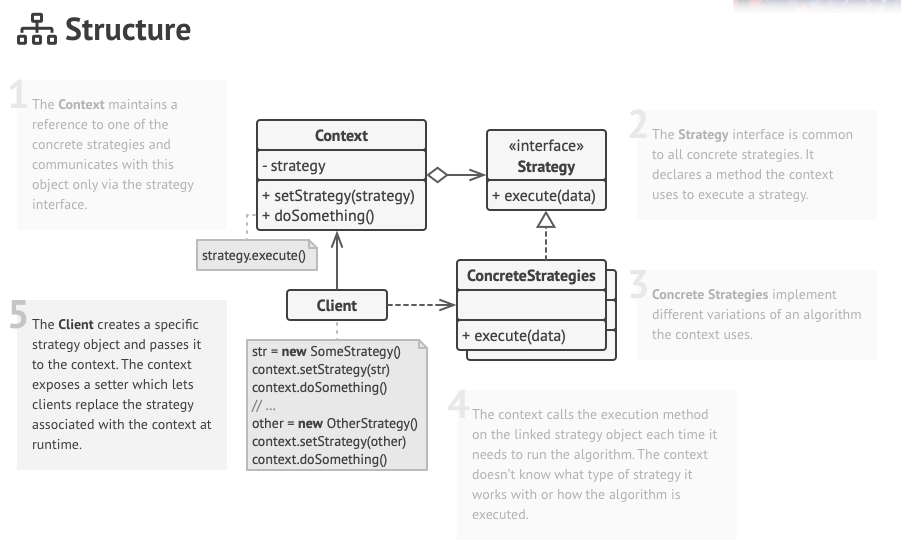

# Strategy

일을 처리하는 알고리즘이 여러개가 있을 때 이를 클래스로 캡슐화를 한 후 위임을 받아서 처리를 하도록 하는 패턴이다.

Startegy Pattern 에서는 캡슐화를 할 때 동일한 인터페이스 타입으로 만들어서 언제든지 알고리즘을 갈아 끼울수 있도록 하는게 핵심이다.

Strategy Pattern 의 구조는 다음과 같다.



- 전략 패턴은 Context 와 Strategy 가 있다.
- Strategy 는 Context 에 있던 Operation 을 뺸 것으로 Context 는 Strategy 를 참조하고 있고 이를 위임을 해서 처리하는 식으로 이뤄진다.

### 장점과 단점

- 새로운 전략을 추가하더라도 기존의 코드는 변경되지 않는다.
- 상속 대신 위임을 사용한다.

### Applicability

- 다양한 알고리즘을 사용해서 문제를 해결할 수 있기를 원한다면 전략 패턴을 고려해보자.
- 핵심 비즈니스의 로직의 구현을 숨기고 싶다면 이 패턴을 고려해보자.
- 클래스에서 동일한 알고리즘이지만 조건예 따라서 조금씩 다르게 실행되는 거라면 전략 패턴을 고려해보자.

### 실제로 사용하는 예

- 자바에서 두 수의 값을 비교하도록 하는 Comparator 가 있다.

```java
Collections.sort(numbers, new Comparator<Integer>() {
	@Override
	public int compare(Integer i1, Integer i2) {
		return i1 - i2; 
	}
}); 
```