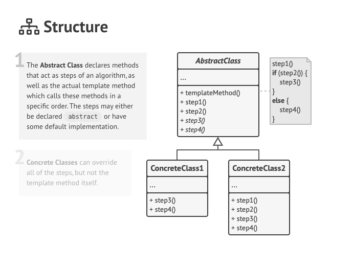

# Template Method 

알고리즘의 구조를 템플릿 형태로 슈퍼 클래스에서 제공하고 그 템플릿에서 구현이 달라야 하는 부분은 서브 클래스가 구현하도록 하는 방법이다.

Template Method 패턴을 사용하지 않는 경우라면 어떻게 코드를 짤 지 예제로 보자.

```java
public class FileProcessor {

    private String path;

    public FileProcessor(String path) {
        this.path = path;
    }

    public int process() {
        try (BufferedReader reader = new BufferedReader(new FileReader(path))) {
            int result = 0;
            String line = null;
            while ((line = reader.readLine()) != null) {
                result += Integer.parseInt(line);
            }
            return result;
        }catch (IOException e) {
            e.printStackTrace();
            throw new IllegalArgumentException(path + " 에 해당하는 파일이 없습니다.");
        }
    }
}
```

```java
public class Client {
    public static void main(String[] args) {
        FileProcessor fileProcessor = new FileProcessor("number.txt");
        int result = fileProcessor.process();
        System.out.println(result);
    }
}
```

- 여기서 FileProcessor 는 파일에 있는 숫자 라인들을 한 줄씩 읽어서 더하는 처리를 한다.
- 만약 이 FileProcessor 말고 파일에 있는 숫자 라인들을 한 줄씩 읽어서 곱하는 처리를 하는 경우라면 어떻게 해야할까?
- MultiplyFileProcessor 라는 서브 클래스들을 하나씩 만들어서 처리하는 방식을 생각할 것이다.
- 근데 이렇게 서브 클래스들을 이용해서 만들어도 코드의 중복되는 부분이 되게 많을 것이다. 결국에는 비슷한 알고리즘을 사용하니까.
- 그래서 이런 코드의 중복을 줄이기 위해서 알고리즘을 스텝별로 슈퍼클래스에 구성해놓고 다른 부분은 서브 클래스에서 구성하는 Template Method 패턴을 쓴다.

Template Method 패턴의 구조는 다음과 같다.



- Abstract class 하나가 있고 여기에 Template Method 역할을 하는 메소드가 있어야 한다.
    - Template Method 는 메소드가 알고리즘 별로 구성된 걸 말한다.
- ConcreteClass 는 Abstract Class 에서 정의 해놓은 알고리즘을 따라가지만 구현이 다른 부분을 여기서 오버라이딩으로 재정의하면 된다.

Template Method 패턴을 쓰면 위의 예제가 이렇게 변경될 것이다.

```java
public abstract class FileProcessor {

    private String path;

    public FileProcessor(String path) {
        this.path = path;
    }

    public final int process() {
        try (BufferedReader reader = new BufferedReader(new FileReader(path))) {
            int result = 0;
            String line = null;
            while ((line = reader.readLine()) != null) {
                result = getResult(result, Integer.parseInt(line));
            }
            return result;
        }catch (IOException e) {
            e.printStackTrace();
            throw new IllegalArgumentException(path + " 에 해당하는 파일이 없습니다.");
        }
    }

    protected abstract int getResult(int result, int number);
}
```

```java
public class PlusProcessor extends FileProcessor {

    public PlusProcessor(String path) {
        super(path);
    }

    @Override
    protected int getResult(int result, int number) {
        return result + number;
    }
}
```

- 슈퍼 클래스가 FileProcessor 이고 서브 클래스가 PlusProcessor 이다.
- File 에서 라인을 읽는 부분까지는 구조가 같으니까 그대로 슈퍼 클래스에서 정의해놓고, 실제로 값을 어떻게 처리할 것인가 부분을 추상 메소드로 정의해놓았다.
- 여기서 보면 process() 메소드는 final 키워드를 통해서 오버라이딩을 못하게 했다. 이 클래스를 구현하는 서브 클래스가 LSP 를 위반할 가능성이 있으니까 막아놓기 위해서.

더 나아가서 Template Method 패턴과 굉장히 유사하지만 조금은 다른 Template Callback 패턴도 살펴보자.

- Template Method 패턴은 상속을 이용해서 문제를 풀었다면 Template Callback 패턴은 위임을 통해서 문제를 해결한다.
- 바로 예제로 보자.

```java
public class FileProcessor {
    private String path;

    public FileProcessor(String path) {
        this.path = path;
    }

    public int process(Operator operator) {
        try (BufferedReader reader = new BufferedReader(new FileReader(path))) {
            int result = 0;
            String line = null;
            while ((line = reader.readLine()) != null) {
                result = operator.getResult(result, Integer.parseInt(line));
            }
            return result;
        }catch (IOException e) {
            e.printStackTrace();
            throw new IllegalArgumentException(path + " 에 해당하는 파일이 없습니다.");
        }
    }
}
```

```java
public interface Operator {
    int getResult(int result, int number);
}
```

- FileProcessor 의 process() 메소드에는 Operator 라는 콜백을 매개변수로 받고있고, 이 부분을 통해서 구현이 다른 부분을 해결한다.
- 그러므로  FileProcessor 는 상속을 할 필요가 없으니 이제 추상클래스로 할 필요가 없다.

### 장점과 단점

- 템플릿 코드를 재사용해서 코드의 중복을 줄일 수 있다.
- SOLID 원칙 중 LSP 를 위반할 수 있다.

### Applicability

- 전체 알고리즘의 구조는 바뀌지 않지만 세부 구현은 변경될 여지가 있을 때 템플릿 메소드 패턴을 고려해보자.
- 몇몇의 클래스가 유사하지만 조금 다른 알고리즘을 사용하고 있다면 이 패턴을 사용해서 코드의 중복을 줄이는 것을 고려해보자.

### 실제로 사용하는 예)

- Spring Security 에 있는 WebSecurityConfigurerAdapter 가 있다.

```java
@Configuration
public class SecurityConfiguration extends WebSecurityConfigurerAdapter {

	@Override
	protected void configure(HttpSecurity http) throws Exception {
		http.authorizeRequests().anyRequest().permitAll(); 
	}
}
```