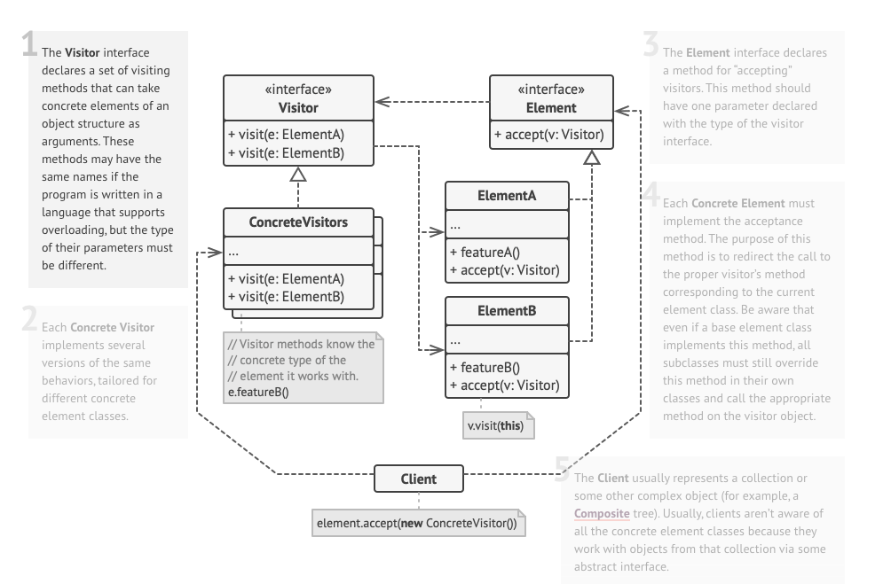

# Visitor 

기존 코드를 건드리지 않고 새로운 기능을 추가하는 방법으로 사용하는 패턴이다.

- 원래는 기존의 클래스에다가 코드를 추가하면서 기능을 추가하는게 일반적이다.
- 근데 그러고 싶지 않은 경우나 그게 SRP 를 위반하는 경우도 있다. 그때 이 패턴을 사용하면 좋아보인다.
    - 확장을 하는데 너무나 많은 코드 작성이 필요한 경우는 추가하고 싶지 않다.

객체의 관계가 Many-To-Many 인 경우 사용이 가능하다. 추가로 행동을 하는 객체도 확장해나갈 수 있다.

이해하기 힘들 수 있으니까 예시로 보자.  Visitor 패턴을 사용하지 않으면 다음과 같이 코드가 이뤄질 것이다.

```java
public interface Shape {
	void printTo(Device device); 
}
```

```java
public class Rectangle implements Shape {
	
	@Override
	public void printTo(Device device) {
		if (device instanceof Phone) {
			...
			// print Rectangle to phone
		} 
		else if (device instanceof Watch) {
			...
			// print Rectangle to watch 
		}
	}
}
```

```java
public class Triangle implements Shape {
	
	@Override
	public void printTo(Device device) {
		if (device instanceof Phone) {
			...
			// print Triangle to Phone		
		}
		else if (device instanceof Watch) {
			...
			// print Rectangle to Watch 
		}
	}
}
```

```java
public interface Device {
	...
}
```

```java
public class Phone implements Device {
	...
}
```

```java
public class Watch implements Device {
	...
}
```

- 각 Shape 는 Device 를 입력으로 받아서 자신의 도형을 그리는 로직들이 있다.
- 이때 Device 의 종류마다 좀 더 다르게 로직을 수행하고 싶어서 Shape 에서는 Device 를 식별하기 위해 많은 if-else 문이 필요로 한다.
- 이 경우에는 OCP 원칙을 깨고 어쩌면 SRP 를 위반하기도 한다. 도형을 그리는 로직이 도형안에 있는게 맞나? 디바이스에 있어야 하는거 아니야? 라고 생각할 수 있다.
- 그리고 새로운 도형이 추가되면 작성해야하는 코드가 많다.
- 물론 이 방법 말고도 다른 대안이 있다고 생각할 수 있다. printTo() 메소드에 Device 를 받는게 아니라 구체적인 타입을 받도록 선언하는, 오버로딩을 이용한 방법이 있다.
    - 이 경우도 문제가 많다. 구체적인 타입을 받도록 정의할 때 부터 인터페이스 타입을 쓰지 못한다.

Visitor 패턴의 구조는 다음과 같다.



- Visitor 패턴은 다수의 Element 와 다수의 Visitor 로 구성된다.
- 주로 처리하는 과정은 Element 에서 accept() 메소드로 인수로 Visitor 를 받으면 Visitor 에  Element 객체 를 넘기는 Double Dispatch 과정을 통해서 처리한다.
    - Dispatch 는 인터페이스 타입의 객체를 넘기면 해당 구현 객체를 찾아서 실행하는 작업을 말한다.

자 그러면 이제 Visitor 패턴을 사용해서 코드를 변경해보자.

```java
public interface Shape {
	public void accept(Device device); 
}
```

```java
public class Rectangle implements Shape {
	
	@Override 
	public void accept(Device device) {
		device.printTo(this); 
	}
}
```

```java
public class Triangle implements Shape {

	@Override
	public void accept(Device device) {
		device.printTo(this); 
	}
}
```

```java
public interface Device {
	void printTo(Rectangle rectangle); 

	void printTo(Triangle trigangle); 
}
```

```java
public class Phone implements Device {
	
	@Override 
	public void printTo(Rectangle rectagnle) {
		...
		// print Rectangle from Phone 
	}

	@Override
	public void printTo(Triangle triangle) {
		...
		// print Triangle from Phone
	}
}
```

```java
public class Watch implements Device {

	@Override
	public void printTo(Rectangle rectangle) {
		...
		// print Rectangle from Watch
	}

	@Override
	public void printTo(Triangle triangle) {
		...
		// print Triangle from Watch 
	}
}
```

- 이 경우 Visitor 는 Phone 과 Watch 그리고 Element 는 Rectangle 과 Triangle 이다.
- 이렇게 변경하게 되면서 print 를 하는 로직을 Device 에다가 넣게 되었고, 새로운 Device 가 나온다고 해도 Element 에서 변경되는 코드는 없다.

대안1) 도형 클래스마다 if-else 절로 처리

여기서 다형성 처리를 해주려면 어떻게 해야할까? 결과적으로 도형 입장에선 디바이스인 인터페이스 타입을 받고 그 인터페이스에서 자신의 도형을 출력하도록 해야한다.

그러므로 도형은 디바이스를 인자로 받고 해당 디바이스에게 자신의 타입을 알려주는 두 번의 디스패치를 하면 된다. 이걸 더블 디스패치 (Double Dispatch) 라고 부른다.

- 여기서 말하는 Dispatch 는 자바의 다형성에서 구체적인 클래스의 메소드를 찾아서 실행하는 걸 말한다.

### 장점과 단점

- 새로운 처리되야 할/처리 할 클래스가 추가 되더라도 기존 코드가 변경되지 않는다.
- 코드의 흐름을 파악하기 힘들다.
- Element 가 하나 삭제되거나 추가된다면 Visitor 내에서 변경되는 코드가 꽤 생긴다.

### Applicability

- 여러 구현 객체에 대해서 처리해야 하는 경우에 이 패턴을 사용하는 걸 생각해볼 수 있다.
- Visitor 패턴을 이용해서 비즈니스 로직을 빼내고 싶은 경우에 생각해볼 수 있다.

### 실제로 사용하는 예

- 다 예제만 있농...