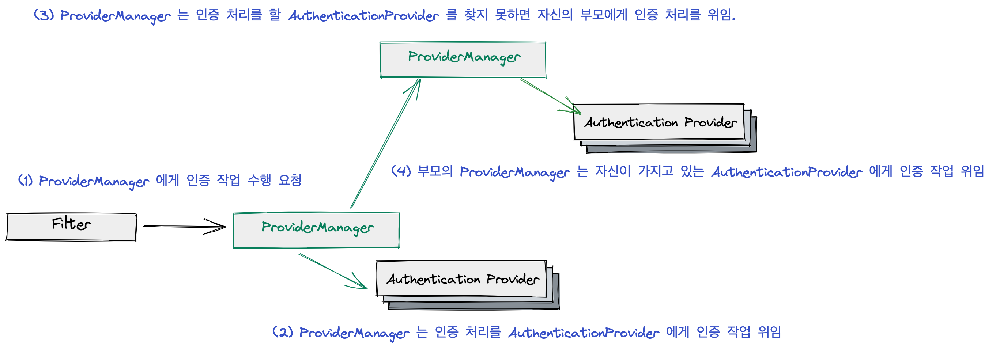

하나의 객체와 계층 구조로 이뤄진 객체를 클라이언트 입장에서 동일하게 느끼도록 하는 패턴.

- 클라이언트는 이게 전체의 요소인지, 전체 중 하나인지 알지 못하고 사용한다.
- 이 패턴을 이용할 땐 트리 구조로 이뤄진다.
- 클라이언트는 Component 의 인터페이스만 바라본다. 즉 결합을 낮출 수 있다.
- 왜 동일하게 봐야할까?
  - 클라이언트 입장에서 너무 많은 결합이 일어날 수도 있기 떄문에.

다음과 같이 Composite 패턴을 사용하지 않는 경우를 보자.

```java
public class Client {
	public static void main(String[] args) {
		Item doranBlade = new Item("도란검", 450); 
		Item healPotion = new Item("체력 물약", 50); 

		Bag bag = new Bag(); 
		bag.add(doranBlade);
		bag.add(healPotion); 

		Client client = new Client(); 
		client.printPrice(doranBlade);
		client.printPrice(bag); 
	}

	private void printPrice(Item item) {
		System.out.prinntln(item.getPrice());
	}

	private void printPrice(Bag bag) {
		int sum = bag.getItems().stream().mapToInt(Item::getPrice).sum(); 
		System.out.println(sum); 
	}
}
```

- 이 경우 Client 는 결합이 너무 많다. Item 과 Bag 모두 알아야 한다.
- printPrice(bag) 의 경우 bag 의 내부 구현을 모두 안다는 단점이 있다. (객체 지향적으로 별로...)
- 확장성 측면에서도 생각해보자. 캐릭터의 가격을 구한다고 생각해보면 printPrice(charcater) 를 구현하고 이 내부 구조도 모두 알아야 할 것이다.

Composite 패턴을 사용ㅇ하면 이렇게 될 것이다.

```java
public interface Component {
	int getPrice(); 
}
```

```java
public class Item implements Component {
	...
	@Override
	public int getPrice() {
		return this.price; 
	}
}
```

```java
public class Bag implements Component {
	private List<Component> components = new ArrayList<>(); 

	public void add(Component componet) {
		this.components.add(component); 
	}	

	@Override 
	public int getPrice() {
		return this.components.stream().mapToInt(Item::getPrice).sum(); 
	}
}
```

```java
public class Client {
	public static void main(String[] args) {
		Item doranBlade = new Item("도란검", 450); 
		Item healPotion = new Item("체력 물약", 50); 

		Bag bag = new Bag(); 
		bag.add(doranBlade);
		bag.add(healPotion); 

		Client client = new Client(); 
		client.printPrice(doranBlade);
		client.printPrice(bag); 
	}

	private void printPrice(Component component) {
		System.out.println(component.getPrice());
	}
}
```

### 장점과 단점

- 트리 구조를 이용하는 경우 좀 더 편하게 사용하는게 가능하다.
- 클라이언트와의 결합을 낮출 수 있다. 이로인해 새로운 타입을 추가하는, 확장에 열려있다.
  - 클라이언트가 알아야 하는 정보를 줄일 수 있다.
- 공통된 인터페이스를 뽑기 위해 지나치게 일반화를 할 수 있다.  (디자인 패턴을 위해서 코드를 작성하면 안된다.)
  - 그래서 실제로 구현체를 체크해야 하는 경우가 생길수도 있다.

### Applicability

- 너가 구현하는 객체 구조가 트리와 같다면 컴포지트 패턴을 사용해라

  - 컴포지트 패턴은 동일한 인터페이스를 제공해줘서 하나의 싱글 객체에서 수행할 수 있고 복합 객체에서도 동일한 메소드로 여러개의 싱글 객체들을 실행할 수 있다.

  - 복합 객체는 또 다른 복합 객체를 가지고 있을 수도 있고 싱글 객체를 가지고 있을 수 있다. (트리 구조와 유사하다.)

- 하나의 객체를 실행하던 복합 객체를 실행하던 일관성 있게 처리하도록 하고 싶다면 컴포지트 패턴을 사용하라.

### 실제로 사용하는 예

spring-securirt 에서 AuthenticationManager 의 구현체인 ProviderManager 가 인증 처리 작업을 Composite pattern 을 이용해서 처리한다.



- 인증 처리 작업을 이렇게 부모-자식 구조로 나눈 이유는 하나의 어플리케이션 안에서도 다른 인증 처리 작업이 필요할 수도 있기 떄문에


코드로는 다음과 같다.

```java

// ProviderManager 의 authenticate 메소드 
@Override
public Authentication authenticate(Authentication authentication) throws AuthenticationException {
	Class<? extends Authentication> toTest = authentication.getClass();
	AuthenticationException lastException = null;
	AuthenticationException parentException = null;
	Authentication result = null;
	Authentication parentResult = null;
	int currentPosition = 0;
	int size = this.providers.size();
	for (AuthenticationProvider provider : getProviders()) {
		if (!provider.supports(toTest)) {
			continue;
		}
		if (logger.isTraceEnabled()) {
			logger.trace(LogMessage.format("Authenticating request with %s (%d/%d)",
					provider.getClass().getSimpleName(), ++currentPosition, size));
		}
		try {
			result = provider.authenticate(authentication);
			if (result != null) {
				copyDetails(authentication, result);
				break;
			}
		}
		catch (AccountStatusException | InternalAuthenticationServiceException ex) {
			prepareException(ex, authentication);
			throw ex;
		}
		catch (AuthenticationException ex) {
			lastException = ex;
		}
	}
	if (result == null && this.parent != null) {
		try {
			parentResult = this.parent.authenticate(authentication); // 부모에게 인증처리 위임
			result = parentResult;
		}
		catch (ProviderNotFoundException ex) {
		}
		catch (AuthenticationException ex) {
			parentException = ex;
			lastException = ex;
		}
	}
	if (result != null) {
		if (this.eraseCredentialsAfterAuthentication && (result instanceof CredentialsContainer)) {
			((CredentialsContainer) result).eraseCredentials();
		}
		if (parentResult == null) {
			this.eventPublisher.publishAuthenticationSuccess(result);
		}

		return result;
	}

	if (lastException == null) {
		lastException = new ProviderNotFoundException(this.messages.getMessage("ProviderManager.providerNotFound",
				new Object[] { toTest.getName() }, "No AuthenticationProvider found for {0}"));
	}
	if (parentException == null) {
		prepareException(lastException, authentication);
	}
	throw lastException;
}
```

또 다른 예

- [https://stackoverflow.com/questions/55242689/composite-design-pattern-with-spring-annotations](https://stackoverflow.com/questions/55242689/composite-design-pattern-with-spring-annotations)